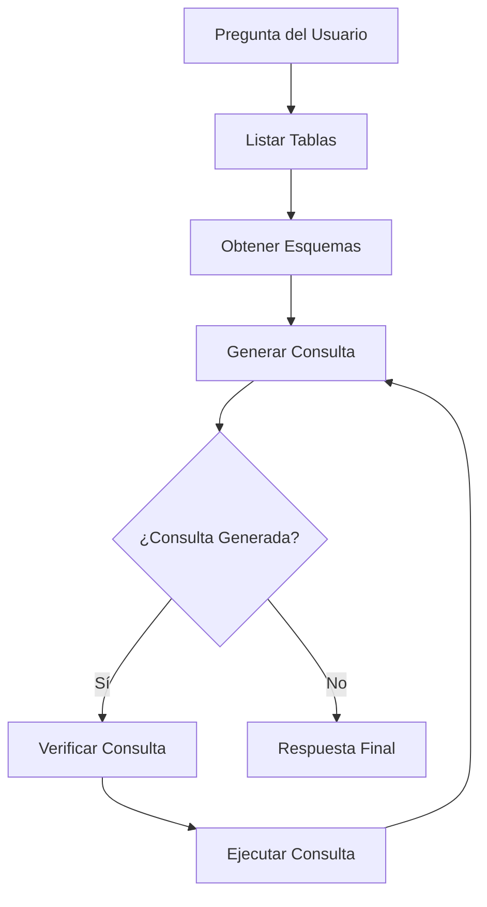

# 🗃️ Agente SQL con LangGraph y Google Gemini

Un agente SQL inteligente que permite hacer preguntas en lenguaje natural sobre bases de datos SQL utilizando LangGraph, Streamlit y Google Gemini.

## ✨ Características

- **Interfaz conversacional**: Haz preguntas en español sobre la base de datos
- **Agente SQL inteligente**: Construido con LangGraph para un flujo de trabajo estructurado
- **Google Gemini**: Utiliza los modelos Gemini 2.5 de Google
- **Base de datos Chinook**: Incluye descarga automática de la base de datos de ejemplo
- **Validación de consultas**: Verifica las consultas SQL antes de ejecutarlas
- **Interfaz moderna**: UI atractiva construida con Streamlit

## 🔧 Instalación

1. **Clona el repositorio** (si es necesario):
```bash
cd sql-agent-gemini
```

2. **Instala las dependencias**:
```bash
pip install -r requirements.txt
```

3. **Configura Google Gemini API**:

   a. **Obtén una API Key**:
      - Ve a [Google AI Studio](https://makersuite.google.com/app/apikey)
      - Crea una nueva API key o usa una existente

   b. **Habilita la API de Generative Language**:
      - Ve a [Google Cloud Console](https://console.cloud.google.com/)
      - Selecciona tu proyecto o crea uno nuevo
      - Ve a "APIs & Services" > "Enable APIs and Services"
      - Busca "Generative Language API"
      - Haz clic en "Enable"
      - **Nota**: Si acabas de habilitar la API, espera unos minutos antes de usarla

   c. **Configura la variable de entorno**:
   
   **Windows (PowerShell)**:
   ```powershell
   $env:GOOGLE_API_KEY="tu-api-key-aqui"
   ```
   
   **Windows (CMD)**:
   ```cmd
   set GOOGLE_API_KEY=tu-api-key-aqui
   ```
   
   **Linux/Mac**:
   ```bash
   export GOOGLE_API_KEY="tu-api-key-aqui"
   ```
   
   **O crea un archivo `.env`** en el directorio del proyecto:
   ```
   GOOGLE_API_KEY=tu-api-key-aqui
   ```

## 🚀 Uso

1. **Asegúrate de que la API Key esté configurada**:
```bash
# Verifica (Windows PowerShell)
echo $env:GOOGLE_API_KEY

# Verifica (Linux/Mac)
echo $GOOGLE_API_KEY
```

2. **Ejecuta la aplicación**:
```bash
streamlit run agent-sql.py
```

3. **Abre tu navegador** en `http://localhost:8501`

4. **Selecciona el modelo** en la barra lateral:
   - `gemini-2.5-flash` (recomendado, más rápido)
   - `gemini-2.5-pro` (más potente)

5. **Haz preguntas** sobre la base de datos, por ejemplo:
   - "¿Qué género tiene las canciones más largas en promedio?"
   - "¿Cuáles son los 5 artistas con más ventas?"
   - "¿Qué país tiene más clientes?"

## 🏗️ Arquitectura del Agente

El agente utiliza un flujo de trabajo estructurado con LangGraph:



### Componentes del Agente:

1. **List Tables**: Lista todas las tablas disponibles
2. **Get Schema**: Obtiene el esquema de las tablas relevantes
3. **Generate Query**: Genera la consulta SQL basada en la pregunta
4. **Check Query**: Verifica la consulta para errores comunes
5. **Run Query**: Ejecuta la consulta validada
6. **Loop**: Reintenta si hay errores hasta obtener resultados

## 📊 Base de Datos Chinook

La aplicación utiliza la base de datos Chinook, que representa una tienda de medios digitales con las siguientes tablas:

- **Artist**: Información de artistas
- **Album**: Álbumes de música
- **Track**: Canciones individuales
- **Genre**: Géneros musicales
- **Customer**: Información de clientes
- **Invoice**: Facturas de ventas
- **Employee**: Empleados de la tienda
- **Playlist**: Listas de reproducción

## 🛠️ Modelos Disponibles

El agente soporta los siguientes modelos de Google Gemini:
- `gemini-2.5-flash` (recomendado - más rápido y eficiente)
- `gemini-2.5-pro` (más potente para consultas complejas)

## 🔍 Ejemplos de Preguntas

### Análisis de Géneros
- "¿Cuál es el género musical más popular?"
- "¿Qué género tiene las canciones más largas?"
- "Muéstrame los géneros ordenados por número de canciones"

### Análisis de Ventas
- "¿Cuáles son los 10 álbumes más vendidos?"
- "¿Qué artista ha generado más ingresos?"
- "¿Cuál es el promedio de ventas por mes?"

### Análisis de Clientes
- "¿De qué países son nuestros clientes?"
- "¿Quién es el cliente que más ha gastado?"
- "¿Cuántos clientes tenemos por ciudad?"

### Análisis de Empleados
- "¿Cuántos empleados hay en cada cargo?"
- "¿Qué empleado ha realizado más ventas?"

## 🚨 Limitaciones y Consideraciones

- **Seguridad**: El agente solo ejecuta consultas SELECT, no permite modificaciones
- **API Key**: Requiere una API key válida de Google Gemini
- **Cuotas**: Revisa los límites de uso gratuito en [Google AI Studio](https://ai.google.dev/pricing)
- **Idioma**: Optimizado para preguntas en español

## 🐛 Solución de Problemas

### Error 403: API no habilitada
```
PermissionDenied: 403 Generative Language API has not been used...
```
**Solución**:
1. Ve al [enlace de activación](https://console.developers.google.com/apis/api/generativelanguage.googleapis.com/overview)
2. Habilita la API "Generative Language API"
3. Espera 2-5 minutos para que se propague
4. Reinicia la aplicación

### Error: API Key no configurada
```
Error al inicializar el modelo: API key not found
```
**Solución**:
```bash
# Windows PowerShell
$env:GOOGLE_API_KEY="tu-api-key-aqui"

# Linux/Mac
export GOOGLE_API_KEY="tu-api-key-aqui"
```

### Base de datos no se descarga
- Verifica tu conexión a internet
- El archivo se descarga automáticamente la primera vez
- Se guarda como `Chinook.db` en el directorio actual

### Error de cuota excedida
Si recibes errores de cuota:
- Revisa tu uso en [Google AI Studio](https://makersuite.google.com/)
- Considera actualizar a un plan de pago si es necesario
- Espera hasta que se restablezca tu cuota diaria

## 📝 Requisitos

```txt
streamlit
langchain-google-genai
langchain-community
langgraph
requests
sqlite3
```

## 📚 Referencias

- [Google Gemini API Documentation](https://ai.google.dev/docs)
- [LangGraph Documentation](https://langchain-ai.github.io/langgraph/)
- [Streamlit Documentation](https://docs.streamlit.io/)
- [Chinook Database](https://www.sqlitetutorial.net/sqlite-sample-database/)

## 🤝 Contribuciones

Las contribuciones son bienvenidas. Por favor:

1. Fork el repositorio
2. Crea una rama para tu feature
3. Commit tus cambios
4. Push a la rama
5. Abre un Pull Request

## 📝 Licencia

Este proyecto está bajo la licencia MIT.
